## CRUD-UserManagement

This is a **User Management App** focusing on **CRUD operations**(create, read, update & delete) created using **NodeJS, ExpressJS** & **MongoDB**. This has a basic functionality of managing user data in form of tables.
We can add a new user, update the data of an existing user, and delete the user completely.

The dynamic rendering of contents is done by **EJS view engine**. The Database used here is **MongoDB Atlas**, connection to which has been established using **Mongoose**. Some of the dependencies used in the project were **NPM, DotEnv, Axios, Morgan & Nodemon.**

### Tech Stack

1. ExpressJS (for routing and API)
2. EJS View Engine (for dynamic rendering)
3. Axios (for API)
4. MongoDB Atlas (for database)
5. Mongoose (for establishing connection to database)
6. NodeJS (for creating server)
7. CSS (for styling)

Here are some Screenshots from the project

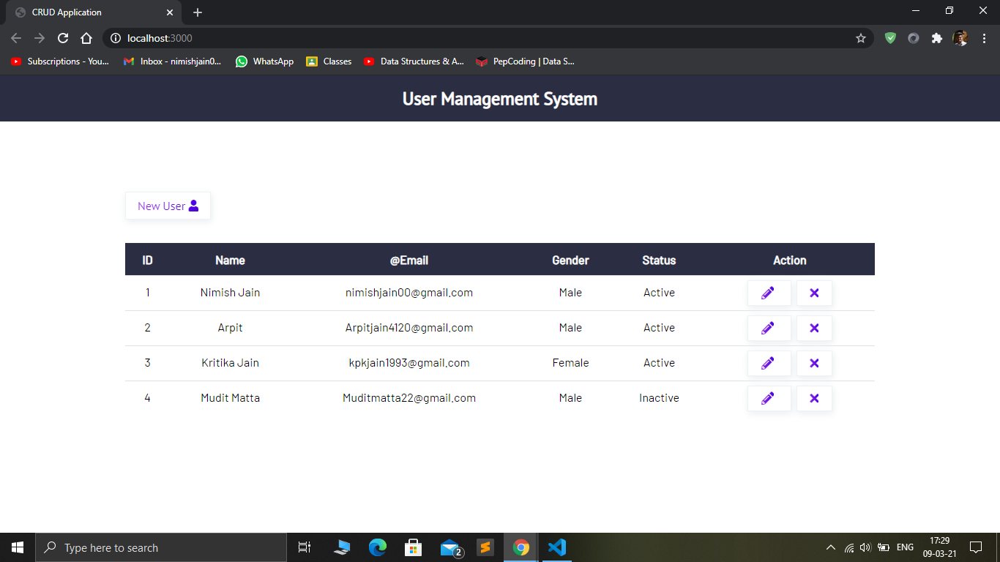

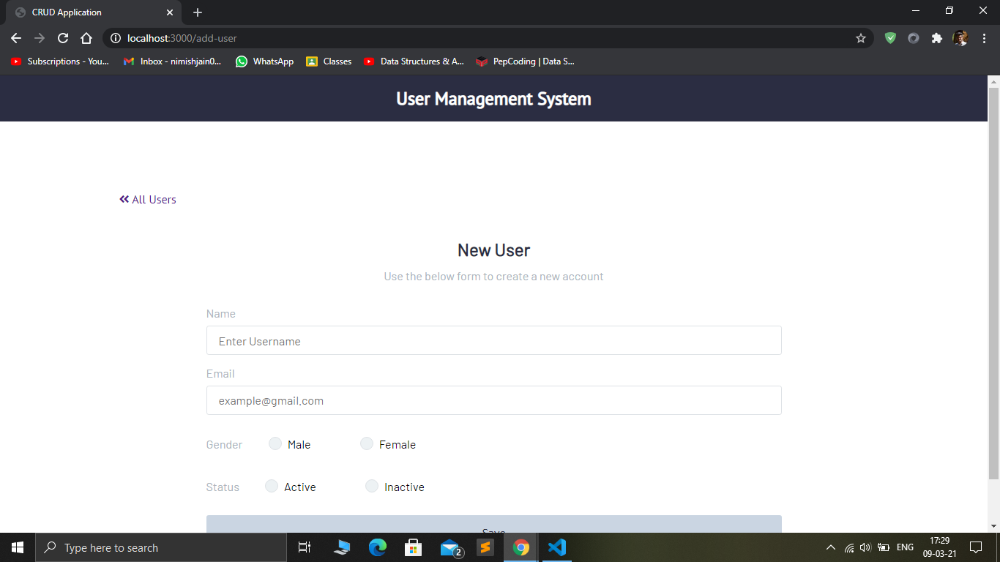

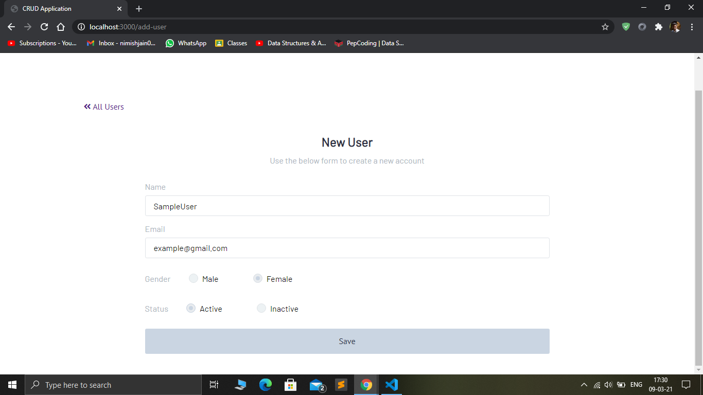

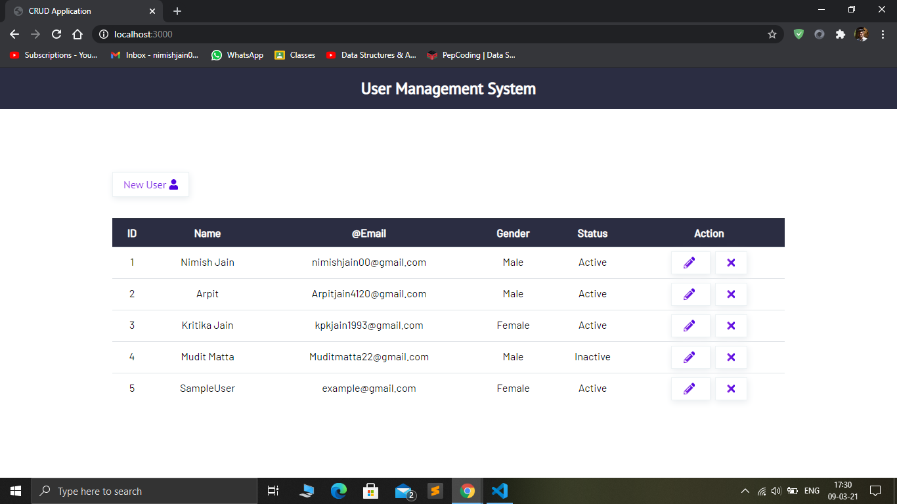

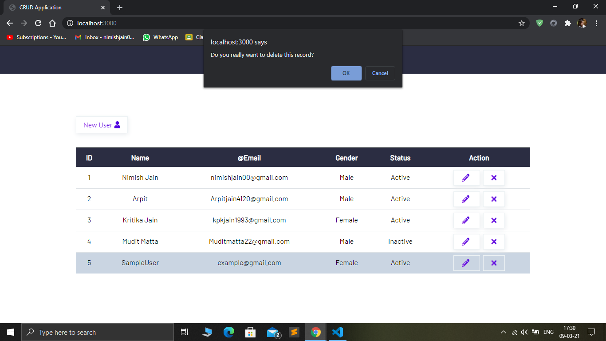

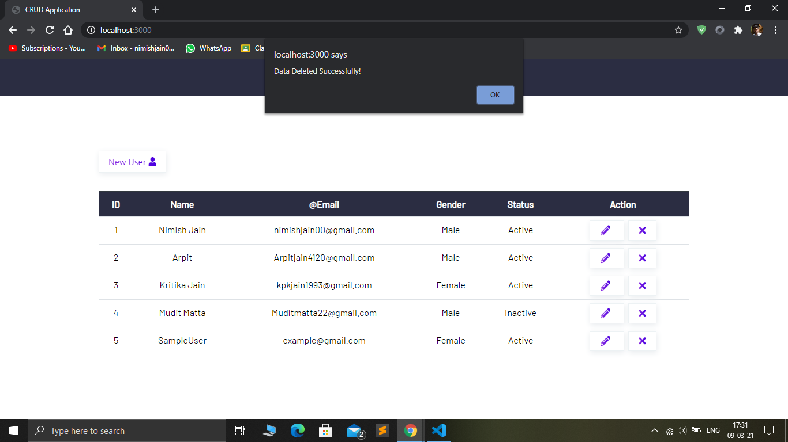

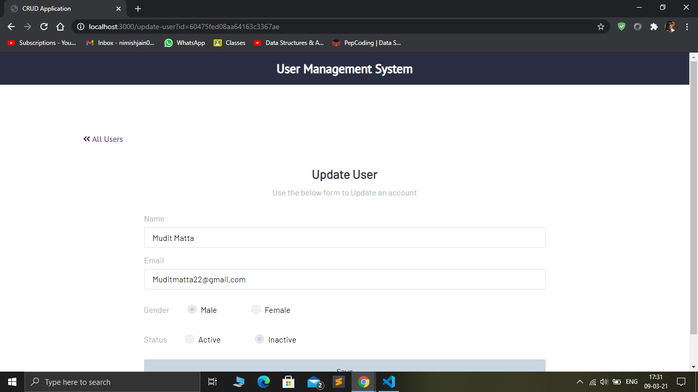

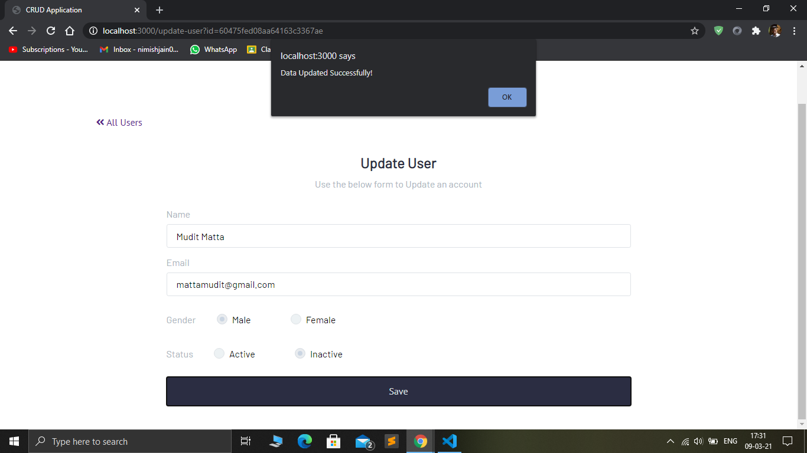

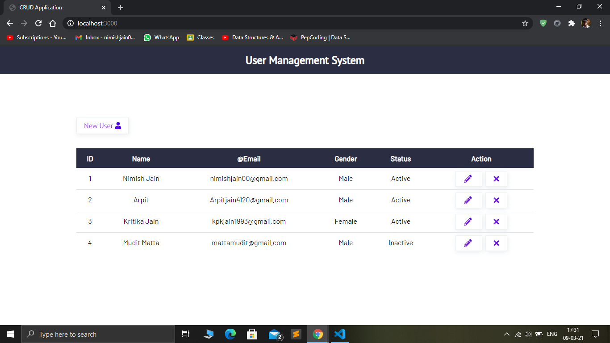

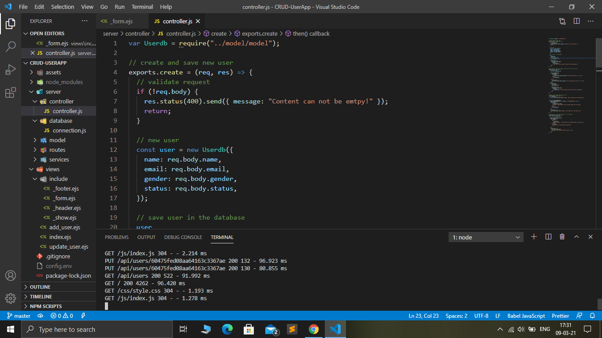

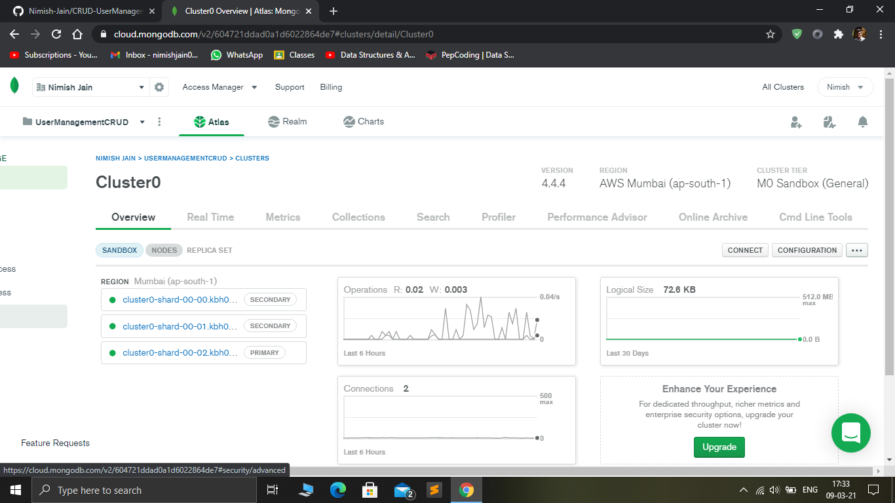
